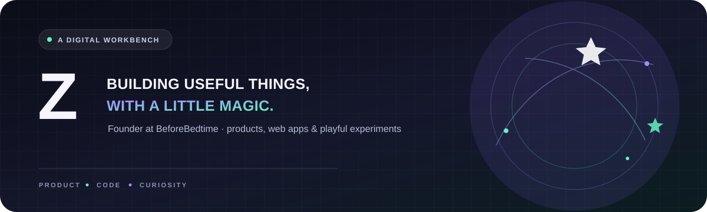

  
   
  <a href="https://beforebedtime.net">BeforeBedtime ↗</a>
  &nbsp;·&nbsp;
  <a href="https://github.com/zlipfatui-ui?tab=repositories">Explore my projects ↗</a>

## Hey, I’m Z.

Founder at [BeforeBedtime](https://beforebedtime.net), building useful products, web apps, and playful experiments.

## Featured work · โปรเจกต์เด่น

<table>
  <tr>
    <td width="50%" valign="top">
      <h3><a href="https://github.com/zlipfatui-ui/BBTLauncher">⌘ BBTLauncher</a></h3>
      
The official Windows launcher for BeforeBedtime, with Microsoft login and automatic modpack sync.

      TypeScript · Windows
    </td>
    <td width="50%" valign="top">
      <h3><a href="https://github.com/zlipfatui-ui/tangpodi">✦ ตังค์พอดี · tangpodi</a></h3>
      
Thai-first personal finance planner for budgets, bills, debt, and savings. ข้อมูลเก็บไว้ในเบราว์เซอร์ของคุณ

      
<a href="https://zlipfatui-ui.github.io/tangpodi/">Live app ↗</a> · <a href="https://github.com/zlipfatui-ui/tangpodi">Source ↗</a>

      TypeScript · Web app · Offline-ready
    </td>
  </tr>
  <tr>
    <td width="50%" valign="top">
      <h3><a href="https://github.com/zlipfatui-ui/arcane-chess">♟ Arcane Chess</a></h3>
      
Single-player fantasy chess where spell cards bend the board without breaking the rules.

      
<a href="https://zlipfatui-ui.github.io/arcane-chess/">Play ↗</a> · <a href="https://github.com/zlipfatui-ui/arcane-chess">Source ↗</a>

      JavaScript · HTML · CSS · Game
    </td>
    <td width="50%" valign="top">
      <h3><a href="https://github.com/zlipfatui-ui/sea-turtle-conservation">🌊 Their Ocean, Their Home</a></h3>
      
An AI-powered campaign website for sea turtle conservation, designed to bring people closer to the ocean.

      
<a href="https://github.com/zlipfatui-ui/sea-turtle-conservation">Explore the project ↗</a>

      HTML · AI-powered storytelling
    </td>
  </tr>
</table>

## Tools in my kit

<code>TypeScript</code> &nbsp; <code>JavaScript</code> &nbsp; <code>HTML</code> &nbsp; <code>CSS</code>

---

  <a href="https://beforebedtime.net">Made with curiosity at BeforeBedtime ↗</a>

