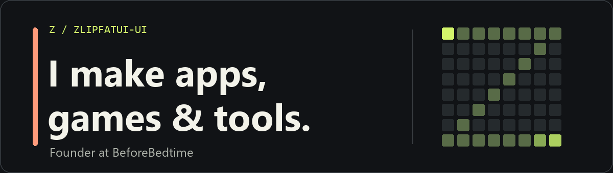
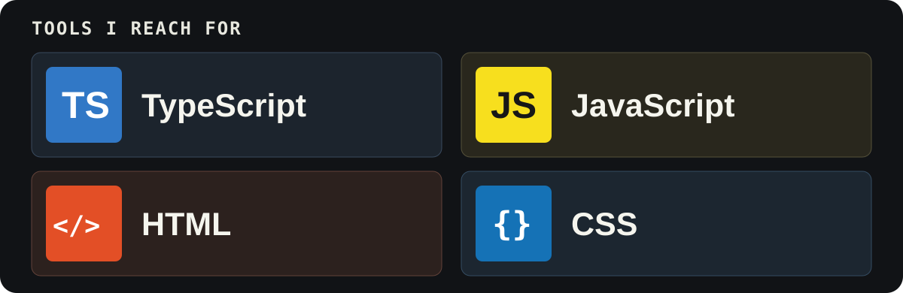

  

## Hey, I'm Z.

I run [BeforeBedtime](https://beforebedtime.net). This GitHub is a mix of practical tools, small games, and ideas I wanted to try.

## Things I've made

### [BBTLauncher](https://github.com/zlipfatui-ui/BBTLauncher)

The Windows launcher for BeforeBedtime. It handles Microsoft sign-in and keeps modpacks up to date.

### [ตังค์พอดี / tangpodi](https://github.com/zlipfatui-ui/tangpodi)

A Thai budget app for bills, debt, and savings. ข้อมูลเก็บไว้ในเบราว์เซอร์ของคุณ

[Try the app](https://zlipfatui-ui.github.io/tangpodi/) · [Source](https://github.com/zlipfatui-ui/tangpodi)

### [Arcane Chess](https://github.com/zlipfatui-ui/arcane-chess)

Chess with spell cards. The board gets weird fast.

[Play](https://zlipfatui-ui.github.io/arcane-chess/) · [Source](https://github.com/zlipfatui-ui/arcane-chess)

### [Their Ocean, Their Home](https://github.com/zlipfatui-ui/sea-turtle-conservation)

A sea turtle conservation campaign site with AI-assisted storytelling.

## Toolkit

